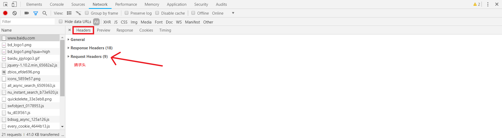
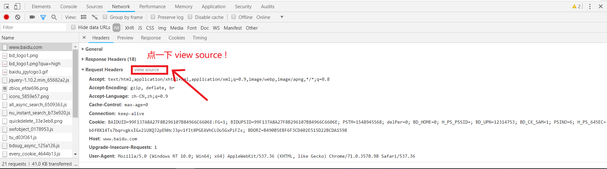
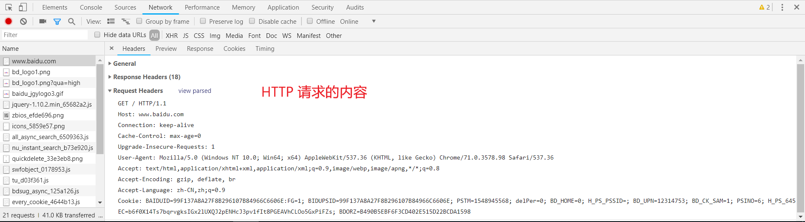
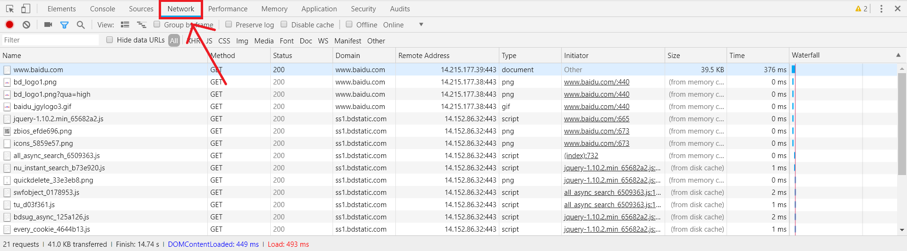
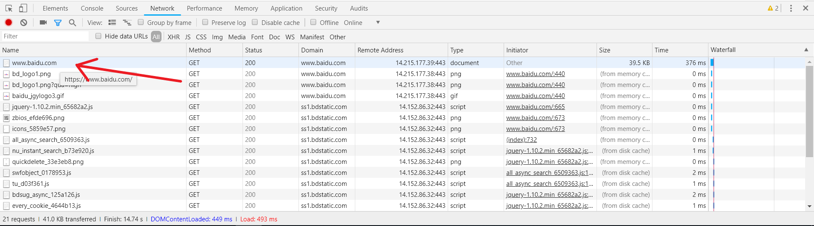
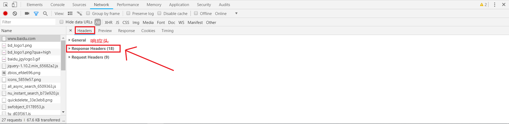
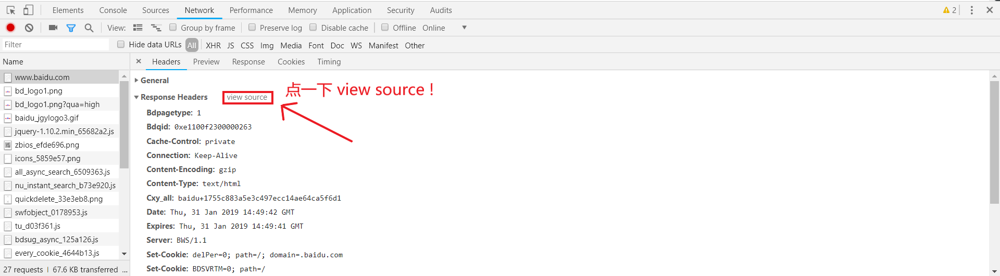
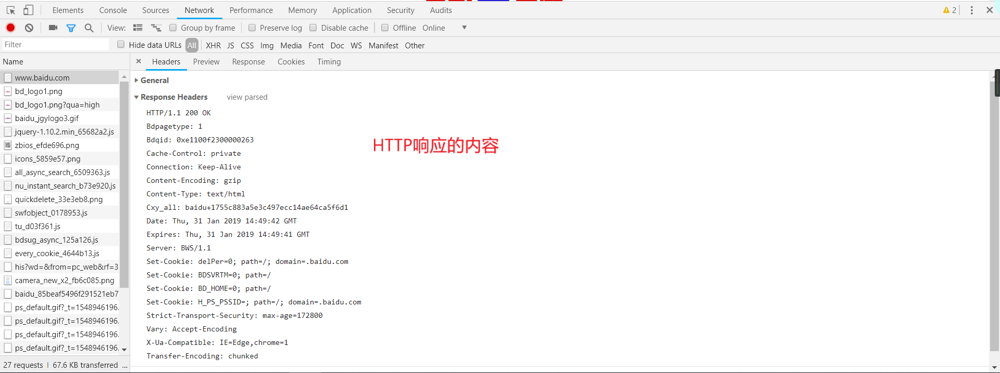

---
title: HTTP相关
date: 2019-02-03 23:52:14
tags:
---

## 要点：

----------


浏览器负责发起请求
服务器在 80 端口接收请求
服务器负责返回内容（响应）
浏览器负责下载响应内容


----------


### 1. HTTP请求

#### 1. HTTP请求最多包含四部分，最少包含三部分。（第四部分可为空）

#### 2. 第三部分永远都是一个回车（\n）！

#### 3. HTTP请求的格式：
    动词 路径 协议/版本                                 （第一部分）
    Key1: value1                                       （第二部分）
    Key2: value2                                       （第二部分）
    Key3: value3                                       （第二部分）
    Content-Type: application/x-www-form-urlencoded    （第二部分）
    Host: www.baidu.com                                （第二部分）
    User-Agent: curl/7.54.0                            （第二部分）
                                                       （第三部分）
    要上传的数据                                        （第四部分）

动词有 GET POST PUT PATCH DELETE HEAD OPTIONS 等
获取 新增/上传 更新 局部更新 删除
这里的路径包括「查询参数」，但不包括「锚点」
如果你没有写路径，那么路径默认为 /
第二部分中的 Content-Type 标注了第四部分的格式

请求举例：
curl -s -v -H “xxx: yyy” – “https://www.baidu.com"

```
$ curl -s -v -H "xxx: yyy" -- "https://www.baidu.com"
<!DOCTYPE html>
<!--STATUS OK--><html> <head><meta http-equiv=content-type content=text/html;charset=utf-8><meta http-equiv=X-UA-Compatible content=IE=Edge><meta content=always name=referrer><link rel=stylesheet type=text/css href=https://ss1.bdstatic.com/5eN1bjq8AAUYm2zgoY3K/r/www/cache/bdorz/baidu.min.css><title>百度一下，你就知道</title></head> <body link=#0000cc> <div id=wrapper> <div id=head> <div class=head_wrapper> <div class=s_form> <div class=s_form_wrapper> <div id=lg>  </div> <form id=form name=f action=//www.baidu.com/s class=fm> <input type=hidden name=bdorz_come value=1> <input type=hidden name=ie value=utf-8> <input type=hidden name=f value=8> <input type=hidden name=rsv_bp value=1> <input type=hidden name=rsv_idx value=1> <input type=hidden name=tn value=baidu><span class="bg s_ipt_wr"><input id=kw name=wd class=s_ipt value maxlength=255 autocomplete=off autofocus=autofocus></span><span class="bg s_btn_wr"><input type=submit id=su value=百度一下 class="bg s_btn" autofocus></span> </form> </div> </div> <div id=u1> <a href=http://news.baidu.com name=tj_trnews class=mnav>新闻</a> <a href=https://www.hao123.com name=tj_trhao123 class=mnav>hao123</a> <a href=http://map.baidu.com name=tj_trmap class=mnav>地图</a> <a href=http://v.baidu.com name=tj_trvideo class=mnav>视频</a> <a href=http://tieba.baidu.com name=tj_trtieba class=mnav>贴吧</a> <noscript> <a href=http://www.baidu.com/bdorz/login.gif?login&amp;tpl=mn&amp;u=http%3A%2F%2Fwww.baidu.com%2f%3fbdorz_come%3d1 name=tj_login class=lb>登录</a> </noscript> <script>document.write('<a href="http://www.baidu.com/bdorz/login.gif?login&tpl=mn&u='+ encodeURIComponent(window.location.href+ (window.location.search === "" ? "?" : "&")+ "bdorz_come=1")+ '" name="tj_login" class="lb">登录</a>');
                </script> <a href=//www.baidu.com/more/ name=tj_briicon class=bri style="display: block;">更多产品</a> </div> </div> </div> <div id=ftCon> <div id=ftConw> <p id=lh> <a href=http://home.baidu.com>关于百度</a> <a href=http://ir.baidu.com>About Baidu</a> </p> <p id=cp>&copy;2017&nbsp;Baidu&nbsp;<a href=http://www.baidu.com/duty/>使用百度前必读</a>&nbsp; <a href=http://jianyi.baidu.com/ class=cp-feedback>意见反馈</a>&nbsp;京ICP证030173号&nbsp;  </p> </div> </div> </div> </body> </html>
*   Trying 14.215.177.39...
* TCP_NODELAY set
* Connected to www.baidu.com (14.215.177.39) port 443 (#0)
* ALPN, offering h2
* ALPN, offering http/1.1
* successfully set certificate verify locations:
*   CAfile: D:/Git/Git/mingw64/ssl/certs/ca-bundle.crt
  CApath: none
} [5 bytes data]
* TLSv1.3 (OUT), TLS handshake, Client hello (1):
} [512 bytes data]
* TLSv1.3 (IN), TLS handshake, Server hello (2):
{ [96 bytes data]
* TLSv1.2 (IN), TLS handshake, Certificate (11):
{ [3501 bytes data]
* TLSv1.2 (IN), TLS handshake, Server key exchange (12):
{ [333 bytes data]
* TLSv1.2 (IN), TLS handshake, Server finished (14):
{ [4 bytes data]
* TLSv1.2 (OUT), TLS handshake, Client key exchange (16):
} [70 bytes data]
* TLSv1.2 (OUT), TLS change cipher, Change cipher spec (1):
} [1 bytes data]
* TLSv1.2 (OUT), TLS handshake, Finished (20):
} [16 bytes data]
* TLSv1.2 (IN), TLS handshake, Finished (20):
{ [16 bytes data]
* SSL connection using TLSv1.2 / ECDHE-RSA-AES128-GCM-SHA256
* ALPN, server accepted to use http/1.1
* Server certificate:
*  subject: C=CN; ST=beijing; L=beijing; OU=service operation department; O=Beijing Baidu Netcom Science Technology Co., Ltd; CN=baidu.com
*  start date: Apr  3 03:26:03 2018 GMT
*  expire date: May 26 05:31:02 2019 GMT
*  subjectAltName: host "www.baidu.com" matched cert's "*.baidu.com"
*  issuer: C=BE; O=GlobalSign nv-sa; CN=GlobalSign Organization Validation CA - SHA256 - G2
*  SSL certificate verify ok.
} [5 bytes data]
> GET / HTTP/1.1
> Host: www.baidu.com
> User-Agent: curl/7.63.0
> Accept: */*
> xxx: yyy
>
{ [5 bytes data]
< HTTP/1.1 200 OK
< Accept-Ranges: bytes
< Cache-Control: private, no-cache, no-store, proxy-revalidate, no-transform
< Connection: Keep-Alive
< Content-Length: 2443
< Content-Type: text/html
< Date: Wed, 30 Jan 2019 14:38:48 GMT
< Etag: "58860402-98b"
< Last-Modified: Mon, 23 Jan 2017 13:24:18 GMT
< Pragma: no-cache
< Server: bfe/1.0.8.18
< Set-Cookie: BDORZ=27315; max-age=86400; domain=.baidu.com; path=/
<
{ [1048 bytes data]
* Connection #0 to host www.baidu.com left intact

```

> GET / HTTP/1.1
> Host: www.baidu.com
> User-Agent: curl/7.63.0
> Accept: */*
> xxx: yyy
>

这部分为请求内容

#### 4. 如何用Chrome开发者工具查看 HTTP 请求内容
    1. 在Chrome上右键选择检查或者按F12后选择Network
    2. 然后输入https://www.baidu.com
    3. 
    4. 
    5. 
    6. 
    7. 


----------


### 2.HTTP响应

#### 1. GET 请求和 POST 请求对应的响应可以一样，也可以不一样

#### 2. 响应的第四部分可以很长很长很长

#### 3. 响应的格式
    协议/版本号 状态码 状态解释            （第一部分）
    Key1: value1                         （第二部分）
    Key2: value2                         （第二部分）
    Content-Length: 17931                （第二部分）
    Content-Type: text/html              （第二部分）
                                         （第三部分）
    要下载的内容                          （第四部分）

状态码要背，是服务器对浏览器说的话
1xx 不常用
2xx 表示成功
3xx 表示滚吧
4xx 表示你丫错了
5xx 表示好吧，我错了
状态解释没什么用
第 2 部分中的 Content-Type 标注了第 4 部分的格式
第 2 部分中的 Content-Type 遵循 MIME 规范

上述举例的响应：

< HTTP/1.1 200 OK
< Accept-Ranges: bytes
< Cache-Control: private, no-cache, no-store, proxy-revalidate, no-transform
< Connection: Keep-Alive
< Content-Length: 2443
< Content-Type: text/html
< Date: Wed, 30 Jan 2019 14:38:48 GMT
< Etag: “58860402-98b”
< Last-Modified: Mon, 23 Jan 2017 13:24:18 GMT
< Pragma: no-cache
< Server: bfe/1.0.8.18
< Set-Cookie: BDORZ=27315; max-age=86400; domain=.baidu.com; path=/
<

#### 4. 如何用Chrome开发者工具查看 HTTP 响应内容
    1. 
    2. 
    3. 
    4. 
    5. 


----------


### 3. 如何使用curl命令

curl 是一种命令行工具，作用是发出网络请求，然后获取数据，显示在”标准输出”（stdout）上面。它支持多种协议，下面列举其常用功能。

1. 直接在 curl 命令后加上网址，就可以看到网页源码。
$ curl https://www.sina.com

2. 显示通信过程：-v 参数可以显示一次 http 通信的整个过程，包括端口连接和 http request 头信息。
如 curl -s -v -H “Frank: xxx” – “https://www.baidu.com"
（这里是GET）
-s 表示不要显示进度条
-v 表示要显示请求和响应，如没有 -v ，则只显示响应
-H 表示使用自定义 http 方法发送具有额外标头的请求

3. curl 默认的 HTTP 动词是 GET，使用 -X 参数可以支持其他动词。
如 curl -X POST -s -v -H “Frank: xxx” – “https://www.baidu.com"
（这里是POST）
-X 表示这个将使用指定的请求，而不是使用其他方法（默认为get）。

4. 发送表单信息
发送表单信息有 GET 和 POST 两种方法。GET 方法相对简单，只要把数据附在网址后面就行。
如 curl example.com/form.cgi?data=xxx

POST 方法必须把数据和网址分开，curl 就要用到 –data 或者 -d 参数。
如 curl -X POST -d “1234567890” -s -v -H “Frank: xxx” – “https://www.baidu.com"
-d 表示data数据，为使用POST方式向server服务器发送数据 1234567890
