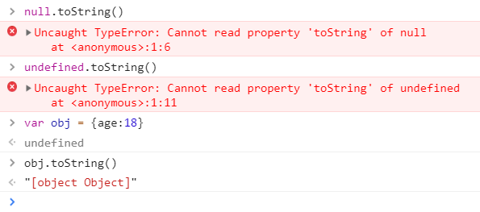
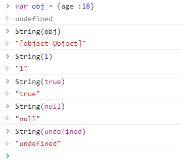
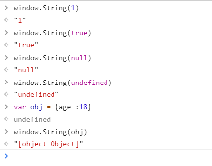
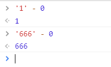
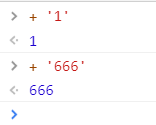
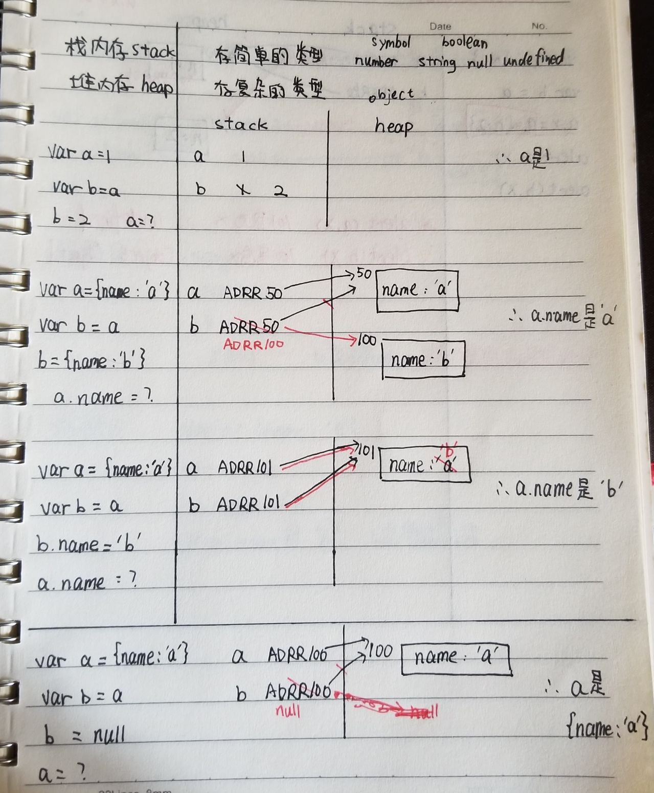
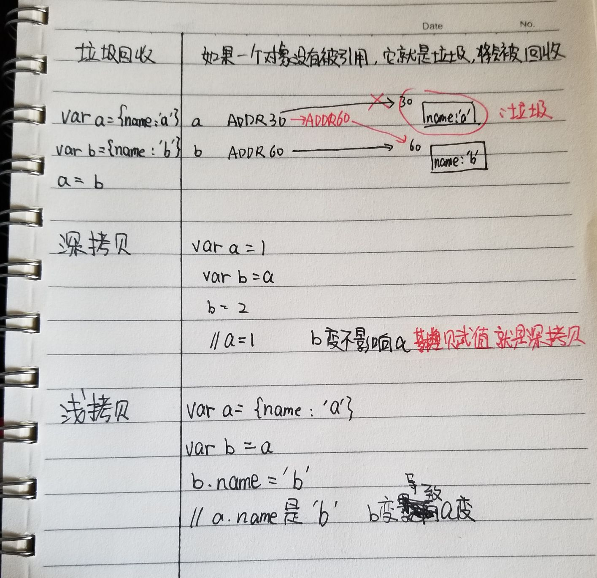

>## JS有7种数据类型，分别是
number string boolean symbol null undefined object

### 某些数据类型之间可以转换

>## 一、数据类型转成字符串
### 1. toString()
```
(1).toString()
//"1"
```


```
true.toString()
//"true"
```


#### null和undefined使用toString会报错，因为它们没有toString属性
#### 对象的toString会得到"[object Object]"




### 2. String


>### 3. + ''
    使用加号和空字符串

```
1 + ''
//"1"
```


```
true + ''
//"true"
```


### 4. window.String



>## 二、数据类型转成布尔值
### 1. Boolean
```
Boolean(1)
//true
```


```
Boolean(0)
//false
```


>### 2. !!
```
!! 1
//true
```


```
!! 0
//false
```


```
!! 'x'
//true 
```

    
#### 注意： 5个falsy值，0，空字符串，null，undefined，NaN
#### 注意： 容易被认作是falsy值，但不是，空格字符串，（空）对象


>## 三、数据类型转成数字
### 1. Number
```
Number('1')
//1
```


### 2. parseInt
```
parseInt('1',10)
//1
```


```
parseInt('2')
//2
```


### 3. parseFloat
```
parseFloat('1.23')
//1.23
```


### 4. x - 0
```
'1' - 0
//1
```




### 4. + x
```
+ '1'
//1
```




>## 四、内存图

#### JS 引擎将内存分为代码区和数据区

#### 数据区分为 Stack（栈内存） 和 Heap（堆内存）

#### 简单类型的数据直接存在 Stack 里

#### 复杂类型的数据是把 Heap 地址存在 Stack 里




