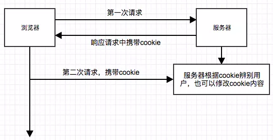
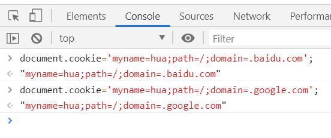
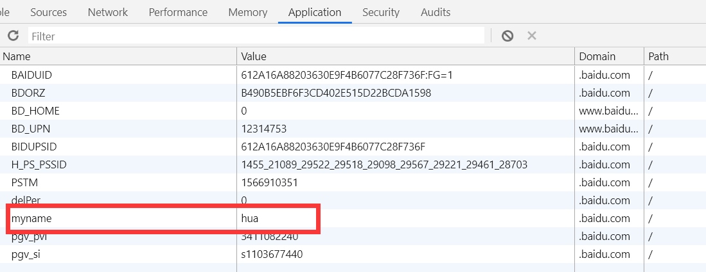
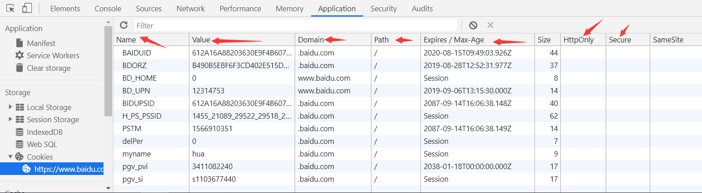
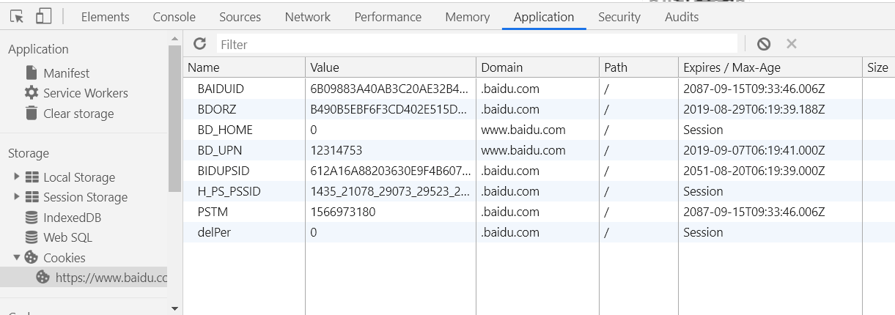
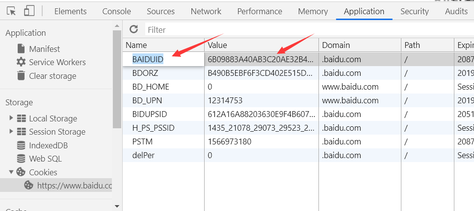

# 1. 概述

----------

Cookie 是服务器保存在浏览器的一小段文本信息，每个 Cookie 的大小一般不能超过4KB。浏览器每次向服务器发出请求，就会自动附上这段信息。

Cookie 主要用来分辨两个请求是否来自同一个浏览器，以及用来保存一些状态信息。

它的常用场合有以下一些。

 - 对话（session）管理：保存登录、购物车等需要记录的信息。
 - 个性化：保存用户的偏好，比如网页的字体大小、背景色等等。
 - 追踪：记录和分析用户行为。

Cookie 包含以下几方面的信息。

 - Cookie 的名字
 - Cookie 的值（真正的数据写在这里面）
 - 到期时间
 - 所属域名（默认是当前域名）
 - 生效的路径（默认是当前网址

）

# 2.原理

----------

# 3. cookie不可跨域

----------

当我打开百度的网页，我要设置一个cookie的时候，我的指令如下

    document.cookie='myname=hua;path=/;domain=.baidu.com';
    document.cookie='myname=hua;path=/;domain=.google.com';

当我将这两个语句都放到浏览器控制台运行的时候

你会发现一点,注意，上面两个cookie的值是不相同的，看清楚

# 4. Cookie 的生成

----------

服务器如果希望在浏览器保存 Cookie，就要在 HTTP 回应的头信息里面，放置一个Set-Cookie字段。

    Set-Cookie:foo=bar

上面代码会在浏览器保存一个名为 **foo** 的 Cookie，它的值为 **bar**。

HTTP 响应可以包含多个 **Set-Cookie** 字段，即在浏览器生成多个 Cookie。

    HTTP/1.0 200 OK
    Content-type: text/html
    Set-Cookie: yummy_cookie=choco
    Set-Cookie: tasty_cookie=strawberry
    
    [page content]

# 5.cookie 的属性

----------

一个 **Set-Cookie** 字段里面，可以同时包括多个属性，没有次序的要求。

1. name
这个显而易见，就是代表cookie的名字的意思，一个域名下绑定的cookie，name不能相同，相同的name的值会被覆盖掉。

2. value
它表示cookie的值

3. domain
**Domain** 属性指定浏览器发出 HTTP 请求时，哪些域名要附带这个 Cookie。如果没有指定该属性，浏览器会默认将其设为当前域名，这时子域名将不会附带这个 Cookie。比如，**example.com** 不设置 Cookie 的domain属性，那么 **sub.example.com** 将不会附带这个 Cookie。如果指定了domain属性，那么子域名也会附带这个 Cookie。如果服务器指定的域名不属于当前域名，浏览器会拒绝这个 Cookie。

4. path
**Path** 属性指定浏览器发出 HTTP 请求时，哪些路径要附带这个 Cookie。只要浏览器发现，**Path** 属性是 HTTP 请求路径的开头一部分，就会在头信息里面带上这个 Cookie。比如，**PATH** 属性是 **/**，那么请求 **/docs** 路径也会包含该 Cookie。当然，前提是域名必须一致。

5. cookie的有效期
什么是有效期，就是图中的 **Expires** 属性，一般浏览器的cookie都是默认储存的，当关闭浏览器结束这个会话的时候，这个cookie也就会被删除，这就是上图中的—— **session** (会话储存)。
如果你想要cookie存在一段时间，那么你可以通过设置 **Expires** 属性为未来的一个时间节点，**Expires** 这个是代表当前时间的，这个属性已经逐渐被我们下面这个主人公所取代—— **Max-Age**
**Max-Age** 属性指定从现在开始 Cookie 存在的秒数，比如60 * 60 * 24 * 365（即一年）。过了这个时间以后，浏览器就不再保留这个 Cookie。因为cookie机制本身没有设置删除cookie，失效的cookie会被浏览器自动从内存中删除，所以，它实现的就是让cookie失效。如果Set-Cookie字段没有指定 **Expires** 或 **Max-Age** 属性，那么这个 Cookie 就是 Session Cookie，即它只在本次对话存在，一旦用户关闭浏览器，浏览器就不会再保留这个 Cookie。

6. secure
**Secure** 属性指定浏览器只有在加密协议 HTTPS 下，才能将这个 Cookie 发送到服务器。另一方面，如果当前协议是 HTTP，浏览器会自动忽略服务器发来的 **Secure** 属性。该属性只是一个开关，不需要指定值。如果通信是 HTTPS 协议，该开关自动打开。

7. HttpOnly
**HttpOnly** 属性指定该 Cookie 无法通过 JavaScript 脚本拿到，主要是 **document.cookie** 属性、**XMLHttpRequest** 对象和 **Request API**  都拿不到该属性。这样就防止了该 Cookie 被脚本读到，只有浏览器发出 HTTP 请求时，才会带上该 Cookie。

# 6. 读写当前网页的 cookie

----------

**document.cookie** 属性用于读写当前网页的 Cookie。
读取的时候，它会返回当前网页的所有 Cookie，前提是该 Cookie 不能有**HTTPOnly**属性。

    document.cookie // "foo=bar;baz=bar"

上面代码从 **document.cookie** 一次性读出两个 Cookie，它们之间使用分号分隔。必须手动还原，才能取出每一个 Cookie 的值。

    var cookies = document.cookie.split(';');
    
    for (var i = 0; i < cookies.length; i++) {
      console.log(cookies[i]);
    }
    // foo=bar
    // baz=bar

**document.cookie** 属性是可写的，可以通过它为当前网站添加 Cookie。

    document.cookie = 'fontSize=14';

写入的时候，Cookie 的值必须写成 **key=value** 的形式。注意，等号两边不能有空格。另外，写入 Cookie 的时候，必须对分号、逗号和空格进行转义（它们都不允许作为 Cookie 的值），这可以用 **encodeURIComponent** 方法达到。

但是，**document.cookie** 一次只能写入一个 Cookie，而且写入并不是覆盖，而是添加。
**document.cookie** 读写行为的差异（一次可以读出全部 Cookie，但是只能写入一个 Cookie），与 HTTP 协议的 Cookie 通信格式有关。浏览器向服务器发送 Cookie 的时候，**Cookie** 字段是使用一行将所有 Cookie 全部发送；服务器向浏览器设置 Cookie 的时候，**Set-Cookie** 字段是一行设置一个 Cookie。

# 7. Cookie 存在的问题

----------

用户可以随意篡改 Cookie

比如我打开百度的首页，查看 cookie，并修改。

双击更改属性
